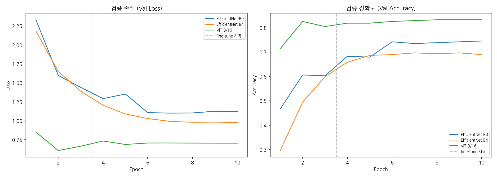
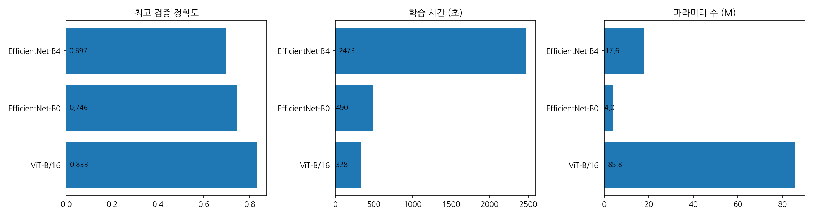

# 2. 알고리즘 설계 및 구현 과정

## 2.1 데이터 수집 및 전처리

### 데이터 출처

- Kaggle: https://www.kaggle.com/datasets/tarundalal/top-15-anime-main-charcters

### 데이터셋 구성

| 컬럼 | 설명 |
|------|------|
| mal_id | 고유 ID |
| url | 상세 페이지 |
| name | 캐릭터 이름 |
| name_kanji | 일본어 이름 |
| nicknames | 별명 |
| image_jpg_url | 이미지 (JPG) |
| image_webp_url | 이미지 (WebP) |

### 정제 코드 설명

Kaggle 데이터셋에서 `image_jpg_url` 컬럼의 URL로 이미지를 다운로드하고, 캐릭터별 폴더(`data/processed/<캐릭터명 - 작품명>/`)로 정리했다. `AnimeCharacterDataset`은 이 폴더 구조를 `ImageFolder` 방식으로 읽어 클래스(캐릭터) 레이블을 자동 부여한다.

**최종 데이터셋 규모:**

| 항목 | 값 |
|------|-----|
| 클래스 수 | 15개 (애니 메인 캐릭터) |
| 전체 이미지 | 1,432장 |
| 학습 / 검증 | 1,145 / 287 (8:2 분할) |
| 이미지 크기 | 224×224 (모든 모델 공통) |

**포함 캐릭터 및 작품:**

에드워드 엘릭(강철의 연금술사), 에렌 예거(진격의 거인), 손오공(드래곤볼), 곤(헌터×헌터), 이치고(블리치), 킬루아(헌터×헌터), 를르슈(코드 기아스), 라이토(데스노트), 루피(원피스), 나루토(나루토), 나츠(페어리 테일), 긴토키(은혼), 사스케(나루토), 베지터(드래곤볼), 조로(원피스)

## 2.2 프로그램 구현 코드 (핵심 스니펫)

> 전체 코드는 별도 파일 제출. 보고서에는 핵심 로직 및 최적화 부분만 기술.

### 모델 구조

`EfficientNetEmbedder`는 timm의 사전학습 backbone에 projection head를 연결한다.

```python
class EfficientNetEmbedder(nn.Module):
    def __init__(self, backbone="efficientnet_b7", embedding_dim=512, pretrained=True):
        super().__init__()
        self.backbone = timm.create_model(backbone, pretrained=pretrained, num_classes=0)
        in_features = self.backbone.num_features
        self.projector = nn.Sequential(
            nn.Linear(in_features, in_features // 2),
            nn.BatchNorm1d(in_features // 2),
            nn.GELU(),
            nn.Linear(in_features // 2, embedding_dim),
        )
```

분류 헤드(`num_classes=0`) 없이 backbone 출력(feature map)을 512차원 임베딩으로 축소한다. 추론 시 `encode()`에서 L2 정규화까지 수행한다.

비교 실험(노트북)에서는 모델을 임베더 구조 없이 timm 분류 모델로 직접 학습해 정확도를 비교했다.

### 학습 루프

2-Phase 전이학습 전략을 사용했다.

```python
# Phase 1: backbone 고정, head만 학습 (LR=1e-3, 3 epoch)
freeze_backbone(model)
opt = torch.optim.AdamW(filter(lambda p: p.requires_grad, model.parameters()), lr=1e-3)

# Phase 2: 전체 fine-tune (LR=1e-4, 7 epoch, CosineAnnealingLR)
unfreeze_all(model)
opt = torch.optim.AdamW(model.parameters(), lr=1e-4, weight_decay=1e-4)
sched = torch.optim.lr_scheduler.CosineAnnealingLR(opt, T_max=7)
```

MPS(Apple Silicon)에서 `torch.autocast`를 활용해 float16 혼합 정밀도 학습으로 속도를 높였다.

### 추론 (검색)

```python
retriever = AnimeRetriever(model, embedding_dim=512)
retriever.build_index(embeddings, labels)   # FAISS에 등록 (내부에서 L2 정규화)

results = retriever.search("query.jpg", top_k=5)
# → [("Naruto - 나루토", 0.923), ("Sasuke - 나루토", 0.871), ...]
```

쿼리 이미지 → backbone 임베딩 → L2 정규화 → `IndexFlatIP` 내적 검색 순서로 top-k 캐릭터와 유사도 점수를 반환한다. 분류가 아닌 검색이므로 새 캐릭터 추가 시 `build_index()` 재실행만 필요하다.

## 2.3 성능 평가 및 결과

### 모델 비교 실험 설정

비교 대상 3개 모델, 동일 데이터·하이퍼파라미터에서 학습:

| 항목 | 값 |
|------|-----|
| 모델 | EfficientNet-B4, EfficientNet-B0, ViT-B/16 |
| 이미지 크기 | 224×224 |
| 배치 크기 | 64 |
| Phase 1 | 3 epoch, LR=1e-3, backbone 고정 |
| Phase 2 | 7 epoch, LR=1e-4, CosineAnnealingLR |
| 디바이스 | Apple M-series MPS |

### 최종 비교 결과

| 모델 | 최고 검증 정확도 | 최종 Val Loss | 학습 시간 | 파라미터 수 |
|------|:--------------:|:------------:|:--------:|:---------:|
| **ViT-B/16** | **83.28%** | 0.7058 | 260초 | 85.8M |
| EfficientNet-B0 | 74.56% | 1.1244 | 1,870초 | 4.0M |
| EfficientNet-B4 | 69.69% | 0.9781 | 4,055초 | 17.6M |

### 주요 관찰

- **ViT-B/16**이 정확도 1위(83.28%). 학습 시간도 가장 짧음(260초). 단, 파라미터 수 85.8M으로 모델 크기는 가장 큼.
- **EfficientNet-B0**이 B4보다 높은 정확도(74.56% vs 69.69%). 더 작은 모델이 더 좋은 성능 → 1,432장의 소규모 데이터에서 B4는 과적합 경향.
- **EfficientNet-B4**는 학습 시간 4,055초로 가장 길면서 정확도는 최하위. 파라미터 17.6M이 데이터 대비 과도함.

### 손실/정확도 곡선



### 모델 비교 바차트


